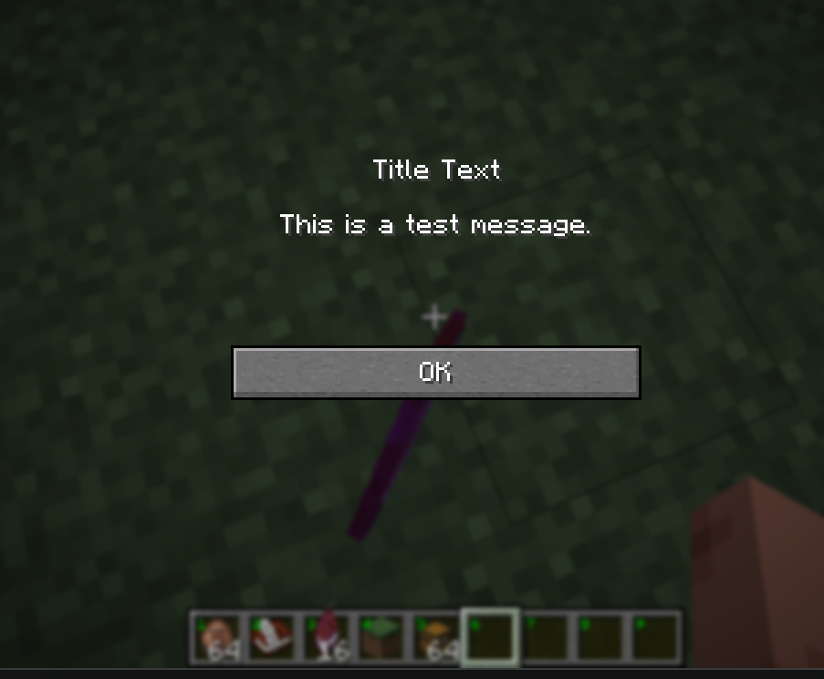

# Minescript Library

Developed in `Minecraft 1.21.11` using `minescript 5.0b11` with `Fabric API 0.141.4`

## Usage
Place the `/code/` (and its contents) `main.py` and `library.py` inside of the minescript folder, then you can simply import the containers from main which you need and use it.
e.g
```
from main import *
```
See /examples
 - [Autofishing script](./examples/autofish.py)
 - [Rename all items in your inventory using the anvil (at your targeted block)](./examples/rename_all_items_in_anvil.py) (with experience / gamemode checks)


For any suggestions or issues with the library please make an issue on this repository

If you are encountering errors, please provide the latest.log file from `%appdata%/.minecraft/logs/latest.log` in the issue.

---
- [Minescript Library](#minescript-library)
  - [Usage](#usage)
  - [GLFWHelper](#glfwhelper)
    - [get\_cursor\_position() -\> Vec2](#get_cursor_position---vec2)
    - [get\_cursor\_gui\_position() -\> Vec2](#get_cursor_gui_position---vec2)
    - [set\_cursor\_position(x: float, y: float)](#set_cursor_positionx-float-y-float)
    - [show\_cursor()](#show_cursor)
    - [hide\_cursor(x: float, y: float)](#hide_cursorx-float-y-float)
    - [disable\_cursor()](#disable_cursor)
    - [is\_cursor\_hidden\_or\_disabled() -\> bool](#is_cursor_hidden_or_disabled---bool)
    - [is\_mouse\_button\_pressed(button: int) -\> bool](#is_mouse_button_pressedbutton-int---bool)
    - [send\_mouse\_button(button: int, press: bool)](#send_mouse_buttonbutton-int-press-bool)
  - [WindowHelper](#windowhelper)
    - [get\_window\_handle() -\> JavaObject](#get_window_handle---javaobject)
    - [set\_window\_title(title: str)](#set_window_titletitle-str)
    - [set\_fullscreen(fullscreen: bool)](#set_fullscreenfullscreen-bool)
    - [is\_window\_fullscreen() -\> bool](#is_window_fullscreen---bool)
    - [is\_window\_minimized() -\> bool](#is_window_minimized---bool)
    - [get\_position() -\> Vec2](#get_position---vec2)
    - [get\_size() -\> WindowSize](#get_size---windowsize)
    - [get\_screen\_size() -\> WindowSize](#get_screen_size---windowsize)
    - [get\_gui\_size() -\> WindowSize:](#get_gui_size---windowsize)
    - [get\_aspect\_ratio() -\> float](#get_aspect_ratio---float)
    - [get\_gui\_scale() -\> float](#get_gui_scale---float)
    - [get\_coordinate\_scale(window\_to\_gui: bool = False) -\> Vec2](#get_coordinate_scalewindow_to_gui-bool--false---vec2)
    - [get\_screen\_position(gui\_x: float, gui\_y: float) -\> Vec2](#get_screen_positiongui_x-float-gui_y-float---vec2)
    - [get\_gui\_position(window\_x: float, window\_y: float) -\> Vec2:](#get_gui_positionwindow_x-float-window_y-float---vec2)
  - [MerchantHelper](#merchanthelper)
    - [is\_container\_merchant() -\> bool](#is_container_merchant---bool)
    - [set\_selected\_trade\_index(index: int)](#set_selected_trade_indexindex-int)
    - [get\_offers\_json() -\> str | None](#get_offers_json---str--none)
    - [get\_xp() -\> int | None](#get_xp---int--none)
    - [get\_total\_xp\_needed\_for\_level\_up() -\> int | None](#get_total_xp_needed_for_level_up---int--none)
    - [get\_level() -\> int | None](#get_level---int--none)
  - [BookScreenHelper](#bookscreenhelper)
    - [is\_edit\_book\_screen() -\> bool](#is_edit_book_screen---bool)
    - [is\_view\_book\_screen() -\> bool](#is_view_book_screen---bool)
    - [is\_sign\_book\_screen() -\> bool](#is_sign_book_screen---bool)
    - [is\_book\_screen() -\> bool](#is_book_screen---bool)
    - [get\_book\_content() -\> List\[str\] | None](#get_book_content---liststr--none)
    - [get\_page\_content(page\_index: int) -\> str | None](#get_page_contentpage_index-int---str--none)
    - [set\_page\_content\_list(pages\_content: List\[str\]) -\> bool](#set_page_content_listpages_content-liststr---bool)
    - [set\_page\_content(page\_index: int, content: str) -\> bool](#set_page_contentpage_index-int-content-str---bool)
    - [get\_page\_count() -\> int | None](#get_page_count---int--none)
    - [is\_last\_page() -\> bool | None](#is_last_page---bool--none)
    - [get\_current\_page\_index() -\> int | None](#get_current_page_index---int--none)
    - [page\_forward() -\> None](#page_forward---none)
    - [page\_back() -\> None](#page_back---none)
    - [sign\_editable\_book(title: str) -\> bool](#sign_editable_booktitle-str---bool)
    - [save\_editable\_book() -\> bool](#save_editable_book---bool)
  - [PlayerHelper](#playerhelper)
    - [get\_food\_info() -\> FoodInfo | None](#get_food_info---foodinfo--none)
    - [get\_gamemode() -\> str | None](#get_gamemode---str--none)
    - [get\_experience() -\> int | None](#get_experience---int--none)
    - [get\_level() -\> int | None](#get_level---int--none-1)
      - [FoodInfo:](#foodinfo)
  - [RegistryHelper](#registryhelper)
    - [get\_by\_id(registry: JavaObject, identifier: str) -\> JavaObject | None](#get_by_idregistry-javaobject-identifier-str---javaobject--none)
    - [get\_id(registry: JavaObject, value: JavaObject) -\> str | None](#get_idregistry-javaobject-value-javaobject---str--none)
    - [get\_registry\_path(registry: JavaObject, value: JavaObject) -\> str | None](#get_registry_pathregistry-javaobject-value-javaobject---str--none)
    - [get\_all\_ids(registry: JavaObject) -\> List\[str\]](#get_all_idsregistry-javaobject---liststr)
    - [get\_registry(registry\_key: JavaObject) -\> JavaObject](#get_registryregistry_key-javaobject---javaobject)
    - [get\_holder\_by\_numeric\_id(numeric\_id: int) -\> JavaObject | None](#get_holder_by_numeric_idnumeric_id-int---javaobject--none)
  - [BlocksHelper](#blockshelper)
    - [get\_block\_pos(x, y=None, z=None) -\> JavaObject](#get_block_posx-ynone-znone---javaobject)
    - [get\_block\_state(x: int|float|JavaObject:, y: int|float|None = None, z: int|float|None = None) -\> JavaObject:](#get_block_statex-intfloatjavaobject-y-intfloatnone--none-z-intfloatnone--none---javaobject)
    - [get\_block\_state\_block(block\_state: JavaObject) -\> JavaObject:](#get_block_state_blockblock_state-javaobject---javaobject)
    - [get\_block\_id(block: JavaObject) -\> str | None:](#get_block_idblock-javaobject---str--none)
    - [get\_block\_state\_id(block\_state: JavaObject) -\> str | None:](#get_block_state_idblock_state-javaobject---str--none)
    - [get\_block\_state\_json(block\_state: JavaObject) -\> JavaObject:](#get_block_state_jsonblock_state-javaobject---javaobject)
    - [get\_block\_entity(x: int|float|JavaObject:, y: int|float|None = None, z: int|float|None = None) -\> JavaObject:](#get_block_entityx-intfloatjavaobject-y-intfloatnone--none-z-intfloatnone--none---javaobject)
    - [is\_command\_block\_entity(block\_entity: JavaObject) -\> bool:](#is_command_block_entityblock_entity-javaobject---bool)
    - [set\_command\_block\_entity\_command(command\_block\_entity: JavaObject, command: str) -\> bool](#set_command_block_entity_commandcommand_block_entity-javaobject-command-str---bool)
    - [get\_command\_block\_entity\_command(command\_block\_entity: JavaObject) -\> str | None](#get_command_block_entity_commandcommand_block_entity-javaobject---str--none)
    - [get\_command\_block\_entity\_last\_output(command\_block\_entity: JavaObject) -\> str | None](#get_command_block_entity_last_outputcommand_block_entity-javaobject---str--none)
    - [get\_command\_block\_entity\_mode(command\_block\_entity: JavaObject) -\> str | None](#get_command_block_entity_modecommand_block_entity-javaobject---str--none)
    - [is\_command\_block\_entity\_conditions\_met(command\_block\_entity: JavaObject) -\> bool | Non](#is_command_block_entity_conditions_metcommand_block_entity-javaobject---bool--non)
    - [is\_command\_block\_entity\_powered(command\_block\_entity: JavaObject) -\> bool | None](#is_command_block_entity_poweredcommand_block_entity-javaobject---bool--none)
    - [is\_command\_block\_entity\_automatic(command\_block\_entity: JavaObject) -\> bool | None](#is_command_block_entity_automaticcommand_block_entity-javaobject---bool--none)
    - [get\_spawner\_block\_entity\_display\_entity\_id(jukebox\_block\_entity: spawner\_block\_entity) -\> str | None](#get_spawner_block_entity_display_entity_idjukebox_block_entity-spawner_block_entity---str--none)
  - [ItemsHelper](#itemshelper)
    - [get\_json(item) -\> str](#get_jsonitem---str)
    - [get\_components(item) -\> str](#get_componentsitem---str)
    - [get\_item\_id(item) -\> str | None](#get_item_iditem---str--none)
    - [get\_numeric\_id(item) -\> int](#get_numeric_iditem---int)
    - [get\_display\_name(item, use\_custom\_name=False) -\> str | None](#get_display_nameitem-use_custom_namefalse---str--none)
    - [get\_count(item) -\> int](#get_countitem---int)
    - [get\_max\_stack\_size(item) -\> int](#get_max_stack_sizeitem---int)
    - [get\_item\_stack\_java\_object(item) -\> JavaObject](#get_item_stack_java_objectitem---javaobject)
    - [get\_item\_java\_object(item) -\> JavaObject](#get_item_java_objectitem---javaobject)
  - [ContainerHelper](#containerhelper)
    - [get\_slot\_screen\_position(slot: int) -\> Vec2 | None](#get_slot_screen_positionslot-int---vec2--none)
    - [get\_container\_layout() | None](#get_container_layout--none)
      - [ContainerLayout](#containerlayout)
      - [DefaultContainerLayout](#defaultcontainerlayout)
      - [CraftingInventoryLayout](#craftinginventorylayout)
      - [ChestLayout](#chestlayout)
      - [GrindstoneLayout](#grindstonelayout)
      - [AnvilLayout](#anvillayout)
      - [BrewingStandLayout](#brewingstandlayout)
      - [EnchantmentLayout](#enchantmentlayout)
      - [MerchantLayout](#merchantlayout)
    - [enchantment\_table\_apply\_enchant(enchantment\_apply\_type: str) -\> bool](#enchantment_table_apply_enchantenchantment_apply_type-str---bool)
    - [enchantment\_table\_get\_enchant\_info(enchantment\_apply\_type) -\> EnchantmentInfo|None:](#enchantment_table_get_enchant_infoenchantment_apply_type---enchantmentinfonone)
      - [`EnchantmentInfo`](#enchantmentinfo)
    - [get\_container() -\> JavaObject | None:](#get_container---javaobject--none)
    - [get\_container\_id() -\> int](#get_container_id---int)
    - [get\_container\_class\_name() -\> str](#get_container_class_name---str)
    - [get\_container\_slot(slot) -\> ItemStack | None](#get_container_slotslot---itemstack--none)
    - [get\_inventory\_slot(slot) -\> ItemStack | None](#get_inventory_slotslot---itemstack--none)
    - [get\_item\_stack\_by\_inventory\_slot(slot) -\> JavaObject | None](#get_item_stack_by_inventory_slotslot---javaobject--none)
    - [get\_item\_stack\_by\_container\_slot(slot) -\> JavaObject | None](#get_item_stack_by_container_slotslot---javaobject--none)
    - [container\_find\_item\_id(item\_id) -\> list\[JavaObject\]](#container_find_item_iditem_id---listjavaobject)
    - [inventory\_find\_item\_id(item\_id) -\> list\[ItemStack\]](#inventory_find_item_iditem_id---listitemstack)
    - [get\_inventory\_free\_slot() -\> int | None](#get_inventory_free_slot---int--none)
    - [get\_inventory\_selected\_hotbar\_slot() -\> int](#get_inventory_selected_hotbar_slot---int)
    - [raw\_click(slot, button\_or\_slot=0, click\_type=None) -\> bool](#raw_clickslot-button_or_slot0-click_typenone---bool)
    - [click\_slot(slot, button=0) -\> bool](#click_slotslot-button0---bool)
    - [shift\_click\_slot(slot) -\> bool](#shift_click_slotslot---bool)
    - [click\_swap\_with\_hotbar(slot, hotbar\_slot) -\> bool](#click_swap_with_hotbarslot-hotbar_slot---bool)
    - [pickup\_swap\_container(slot\_a, slot\_b) -\> bool](#pickup_swap_containerslot_a-slot_b---bool)
  - [FishingHelper](#fishinghelper)
    - [is\_holding\_rod() -\> bool](#is_holding_rod---bool)
    - [is\_casted() -\> bool](#is_casted---bool)
    - [is\_biting() -\> bool | None](#is_biting---bool--none)
    - [is\_open\_water() -\> bool | None](#is_open_water---bool--none)
    - [get\_hooked\_entity() -\> JavaObject | None](#get_hooked_entity---javaobject--none)
    - [get\_time\_until\_lured() -\> int | None](#get_time_until_lured---int--none)
    - [get\_time\_until\_hooked() -\> int | None](#get_time_until_hooked---int--none)
    - [use\_rod() -\> bool](#use_rod---bool)
  - [ScreenHelper](#screenhelper)
    - [get\_anvil\_experience\_required() -\> int | None](#get_anvil_experience_required---int--none)
    - [get\_current\_screen() -\> JavaObject | None](#get_current_screen---javaobject--none)
    - [get\_current\_screen\_class\_name() -\> str](#get_current_screen_class_name---str)
    - [get\_container\_bounds() -\> ContainerBounds | None](#get_container_bounds---containerbounds--none)
    - [set\_current\_screen(screen) -\> None](#set_current_screenscreen---none)
    - [close\_current\_screen(with\_close\_container\_packet=True) -\> None](#close_current_screenwith_close_container_packettrue---none)
    - [open\_alert\_screen(title\_text: str, message\_text: str, ok\_button\_text: str = "OK")](#open_alert_screentitle_text-str-message_text-str-ok_button_text-str--ok)
    - [open\_pause\_screen() -\> None](#open_pause_screen---none)
    - [open\_inventory\_screen() -\> None](#open_inventory_screen---none)
    - [show\_toast(title: str, desc: str, display\_time: float = 5000.0)](#show_toasttitle-str-desc-str-display_time-float--50000)
    - [set\_anvil\_screen\_text(text: str) -\> bool](#set_anvil_screen_texttext-str---bool)
    - [get\_anvil\_screen\_text() -\> str | None](#get_anvil_screen_text---str--none)
    - [is\_any\_toast\_showing() -\> bool](#is_any_toast_showing---bool)
  - [WidgetScreenHelper](#widgetscreenhelper)
    - [get\_widgets() -\> List\[GuiWidget\] | None](#get_widgets---listguiwidget--none)
    - [GuiWidget:](#guiwidget)
    - [get\_renderables() -\> List\[JavaObject\] | None](#get_renderables---listjavaobject--none)
    - [get\_widget\_by\_message(text: str, match\_case: bool = False) -\> GuiWidget | None](#get_widget_by_messagetext-str-match_case-bool--false---guiwidget--none)
    - [click\_widget(widget: GuiWidget | JavaObject) -\> bool](#click_widgetwidget-guiwidget--javaobject---bool)
    - [click\_at(x: float, y: float, button: int = 0) -\> bool](#click_atx-float-y-float-button-int--0---bool)
  - [ClientHelper](#clienthelper)
    - [disconnect(reason="Disconnected by Minescript") -\> None](#disconnectreasondisconnected-by-minescript---none)
    - [get\_fps() -\> int](#get_fps---int)
    - [get\_camera\_position() -\> Vector3f](#get_camera_position---vector3f)
    - [get\_camera\_block\_position() -\> Vector3f](#get_camera_block_position---vector3f)
    - [get\_camera\_type() -\> str](#get_camera_type---str)
    - [get\_level\_data() -\> ClientLevelData](#get_level_data---clientleveldata)
      - [ClientLevelData](#clientleveldata)
    - [narrate\_text(text: str)](#narrate_texttext-str)
  - [MappingsHelper](#mappingshelper)
    - [get\_runtime\_class\_name(pretty\_class\_name) -\> str](#get_runtime_class_namepretty_class_name---str)
    - [get\_pretty\_class\_name(runtime\_class\_name) -\> str](#get_pretty_class_nameruntime_class_name---str)
    - [get\_runtime\_field\_name(clazz, pretty\_field\_name) -\> str](#get_runtime_field_nameclazz-pretty_field_name---str)
    - [get\_pretty\_field\_names(clazz) -\> JavaSet\[str\]](#get_pretty_field_namesclazz---javasetstr)
    - [get\_runtime\_method\_names(clazz, pretty\_method\_name) -\> JavaSet\[str\]](#get_runtime_method_namesclazz-pretty_method_name---javasetstr)
    - [get\_pretty\_method\_names(clazz) -\> JavaSet\[str\]](#get_pretty_method_namesclazz---javasetstr)
  - [ReflectionHelper](#reflectionhelper)
    - [get\_private\_field(instance, pretty\_field\_name) -\> Any|None](#get_private_fieldinstance-pretty_field_name---anynone)
    - [set\_private\_field(instance, pretty\_field\_name, value) -\> bool](#set_private_fieldinstance-pretty_field_name-value---bool)
    - [get\_declared\_method\_accessible(instance, pretty\_method\_name)](#get_declared_method_accessibleinstance-pretty_method_name)
    - [invoke\_private\_method(instance, pretty\_method\_name, \*args):](#invoke_private_methodinstance-pretty_method_name-args)
    - [is\_instance\_of(instance: JavaObject, class\_name: str) -\> bool](#is_instance_ofinstance-javaobject-class_name-str---bool)
  - [UtilHelper](#utilhelper)
    - [get\_class\_name(obj) -\> str](#get_class_nameobj---str)
    - [get\_clipboard() -\> str](#get_clipboard---str)
    - [set\_clipboard(text) -\> None](#set_clipboardtext---none)
    - [random\_uuid() -\> str](#random_uuid---str)
  - [StatisticsHelper](#statisticshelper)
    - [get\_stats() -\> List\[StatGroup\]](#get_stats---liststatgroup)
      - [StatGroup:](#statgroup)
      - [Stat:](#stat)
    - [get\_stat\_value(stat: JavaObject) -\> int:](#get_stat_valuestat-javaobject---int)
  - [XaeroHelper](#xaerohelper)
    - [is\_mod\_loaded() -\> bool:](#is_mod_loaded---bool)
    - [get\_current\_waypoint\_set\_name() -\> str | None](#get_current_waypoint_set_name---str--none)
    - [get\_current\_set\_waypoints() -\> List\[Waypoint\] | None](#get_current_set_waypoints---listwaypoint--none)
    - [Waypoint:](#waypoint)
    - [add\_waypoint\_to\_current\_set(name: str, x: float|int, y: float|int, z: float|int, initials: str) -\> bool | None](#add_waypoint_to_current_setname-str-x-floatint-y-floatint-z-floatint-initials-str---bool--none)
    - [remove\_waypoint\_from\_current\_set(waypoint: Waypoint | int) -\> bool:](#remove_waypoint_from_current_setwaypoint-waypoint--int---bool)
    - [get\_waypoint\_from\_current\_set(waypoint: Waypoint | int) -\> Waypoint | None:](#get_waypoint_from_current_setwaypoint-waypoint--int---waypoint--none)
    - [get\_current\_waypoint\_set\_count() -\> int | None:](#get_current_waypoint_set_count---int--none)
    - [get\_current\_minimap\_session() -\> JavaObject | None](#get_current_minimap_session---javaobject--none)
    - [get\_current\_world\_manager() -\> JavaObject | None](#get_current_world_manager---javaobject--none)
    - [get\_current\_world() -\> JavaObject | None:](#get_current_world---javaobject--none)
    - [get\_current\_waypoint\_set() -\> JavaObject | None:](#get_current_waypoint_set---javaobject--none)

---

## GLFWHelper

### get_cursor_position() -> Vec2
Vec2 has x,y fields

### get_cursor_gui_position() -> Vec2
Vec2 has x,y fields

### set_cursor_position(x: float, y: float)
### show_cursor()
### hide_cursor(x: float, y: float)
### disable_cursor()
### is_cursor_hidden_or_disabled() -> bool
### is_mouse_button_pressed(button: int) -> bool

### send_mouse_button(button: int, press: bool)
Click the current position on the screen, (or release if press is set to false)

```py
GLFW_MOUSE_BUTTON_LEFT = 0
GLFWHelper.set_cursor_position(439.0, 425.0) # some position you retrieved earlier with get_cursor_position
GLFWHelper.send_mouse_button(GLFW_MOUSE_BUTTON_LEFT, True)
```

---

## WindowHelper

### get_window_handle() -> JavaObject
Returns a `java.lang.Long` JavaObject

### set_window_title(title: str)
### set_fullscreen(fullscreen: bool)
### is_window_fullscreen() -> bool
### is_window_minimized() -> bool
### get_position() -> Vec2
Vec2 has x,y fields

### get_size() -> WindowSize
WindowSize has width,height fields

### get_screen_size() -> WindowSize
### get_gui_size() -> WindowSize:
### get_aspect_ratio() -> float
### get_gui_scale() -> float
### get_coordinate_scale(window_to_gui: bool = False) -> Vec2

### get_screen_position(gui_x: float, gui_y: float) -> Vec2
Vec2 has x,y fields

Convert Minecraft GUI-scaled coordinates into absolute window coordinates
This function is used by `get_slot_screen_position` to calculate the position of a slot in a container
```py
slot = container.getSlot(slot)

# Calculate relative to the container's screen origin
bounds = ScreenHelper.get_container_bounds()
if bounds is None:
    return None

gui_x = bounds.left + slot.x + 8
gui_y = bounds.top + slot.y + 8

return WindowHelper.get_screen_position(gui_x, gui_y)
```

### get_gui_position(window_x: float, window_y: float) -> Vec2:
Vec2 has x,y fields. 
Inverse of `get_screen_position`

---

## MerchantHelper
There is also a [MerchantLayout](#merchantlayout) which can be returned by [get\_container\_layout() | None](#get_container_layout--none)

### is_container_merchant() -> bool

### set_selected_trade_index(index: int)
Automatically puts in the correct items from your inventory into the slots if possible

### get_offers_json() -> str | None

```
print(MerchantHelper.get_offers_json())
# ->
# [{"buy":{"id":"minecraft:wheat","count":20},"sell":{"id":"minecraft:emerald","count":1},"maxUses":16,"priceMultiplier":0.05,"xp":2},{"buy":{"id":"minecraft:beetroot","count":15},"sell":{"id":"minecraft:emerald","count":1},"maxUses":16,"priceMultiplier":0.05,"xp":2}]
```

### get_xp() -> int | None
### get_total_xp_needed_for_level_up() -> int | None
### get_level() -> int | None

---

## BookScreenHelper

### is_edit_book_screen() -> bool
### is_view_book_screen() -> bool
### is_sign_book_screen() -> bool

### is_book_screen() -> bool
Wrapper for is_edit_book_screen() || is_view_book_screen() || is_sign_book_screen()

### get_book_content() -> List[str] | None

### get_page_content(page_index: int) -> str | None

### set_page_content_list(pages_content: List[str]) -> bool
### set_page_content(page_index: int, content: str) -> bool
If the page index doesn't exist it will keep adding empty pages until it does.

### get_page_count() -> int | None

### is_last_page() -> bool | None

### get_current_page_index() -> int | None
to get the current page "number" as shown on screen get_current_page_index + 1

### page_forward() -> None
### page_back() -> None

### sign_editable_book(title: str) -> bool

### save_editable_book() -> bool
Saves the current edits to the book & quill and closes the screen (equivalent to clicking "Done").

---

## PlayerHelper

### get_food_info() -> FoodInfo | None
Returns the player's food, saturation, and exhaustion levels.

### get_gamemode() -> str | None
`adventure`, `survival`, `creative`, or `spectator`

### get_experience() -> int | None
### get_level() -> int | None

#### FoodInfo:
- food_level: int
- saturation_level: float
- exhaustion_level: float
- def __init__(self, food_level: int, saturation_level: float, exhaustion_level: float)

---

## RegistryHelper

### get_by_id(registry: JavaObject, identifier: str) -> JavaObject | None
Gets an object from the specified registry by its identifier string (e.g, `minecraft:diamond`)

### get_id(registry: JavaObject, value: JavaObject) -> str | None
Gets the full identifier string (e.g, `minecraft:stone`) for a value in a registry

### get_registry_path(registry: JavaObject, value: JavaObject) -> str | None
Gets only the path part of the identifier (e.g, `stone`) for a value in a registry

### get_all_ids(registry: JavaObject) -> List[str]
Returns a list of all identifier strings in the given registry

### get_registry(registry_key: JavaObject) -> JavaObject
Returns the registry object for the given registry key. e.g, `RegistryHelper.Registries.BLOCK`

### get_holder_by_numeric_id(numeric_id: int) -> JavaObject | None

---
## BlocksHelper

### get_block_pos(x, y=None, z=None) -> JavaObject

Create a Minecraft `net.minecraft.core.BlockPos` Java object from a position or coordinates.

Accepted formats:

- `x, y, z`: Individual numeric coordinates (float or int)

All float values are automatically converted to integers, they are simply allowed for compatability purposes

```
targeted_block_pos = minescript.player_get_targeted_block()
if targeted_block_pos is not None:
    x, y, z = targeted_block_pos.position
    block_pos = BlocksHelper.get_block_pos(x, y, z)
```

### get_block_state(x: int|float|JavaObject:, y: int|float|None = None, z: int|float|None = None) -> JavaObject:

Returnws the minecraft `net.minecraft.world.level.block.state.BlockState` Java object from a position or coordinates.

Accepted formats:
- `x, y, z`: Individual numeric coordinates (float or int)
- `JavaObject` of `net.minecraft.core.BlockPos` passed into x and y/z are left to None

### get_block_state_block(block_state: JavaObject) -> JavaObject:

Returnws the minecraft `net.minecraft.world.level.block.Block` from a blockstate

Accepted formats:
- `JavaObject` of ``net.minecraft.world.level.block.state.BlockState`

### get_block_id(block: JavaObject) -> str | None:
s
Accepted formats:
- `block`: `net.minecraft.world.level.block.Block` JavaObject

### get_block_state_id(block_state: JavaObject) -> str | None:

Accepted formats:
- `block_state`: `net.minecraft.world.level.block.state.BlockState` JavaObject

### get_block_state_json(block_state: JavaObject) -> JavaObject:

Accepted formats:
- `JavaObject` of `net.minecraft.world.level.block.state.BlockState`
  
```py
targeted_block_pos = player_get_targeted_block()
if targeted_block_pos is not None:
    x, y, z = targeted_block_pos.position
    block_state = BlocksHelper.get_block_state(x, y, z)
        print(BlocksHelper.get_block_state_json(block_state)) # -> "{"Properties":{"powered":"false","open":"true","in_wall":"false","facing":"north"},"Name":"minecraft:oak_fence_gate"}"
```

### get_block_entity(x: int|float|JavaObject:, y: int|float|None = None, z: int|float|None = None) -> JavaObject:

Returnws the minecraft `net.minecraft.world.level.block.entity.BlockEntity` Java object from a position or coordinates.

Accepted formats:
- `x, y, z`: Individual numeric coordinates (float or int)
- `JavaObject` of `net.minecraft.core.BlockPos` passed into x and y/z are left to None


```
targeted_block_pos = player_get_targeted_block()
if targeted_block_pos is not None:
    x, y, z = targeted_block_pos.position
    
    block_pos = BlocksHelper.get_block_pos(x, y, z)
    block_entity = BlocksHelper.get_block_entity(block_pos)

    # Or simply
    block_entity = BlocksHelper.get_block_entity(x, y, z)

    if block_entity is not null:
        print(UtilHelper.get_class_name(block_entity)) -> net.minecraft.world.level.block.entity.CommandBlockEntity      
```

### is_command_block_entity(block_entity: JavaObject) -> bool:
### set_command_block_entity_command(command_block_entity: JavaObject, command: str) -> bool
### get_command_block_entity_command(command_block_entity: JavaObject) -> str | None

```
block_entity = ... # See previous example
if UtilHelper.get_class_name(command_block_entity) == "net.minecraft.world.level.block.entity.
    print(BlocksHelper.get_command_block_entity_command(block_entity)) # -> setblock ~ ~10 ~ minecraft:redstone_block
    print(BlocksHelper.get_command_block_entity_last_output(block_entity)) # -> [@: Changed the block at 163, 94, 125]
```

### get_command_block_entity_last_output(command_block_entity: JavaObject) -> str | None
### get_command_block_entity_mode(command_block_entity: JavaObject) -> str | None

Returns SEQUENCE or AUTO or REDSTONE
(Sequence being the CHAIN Command Block)

### is_command_block_entity_conditions_met(command_block_entity: JavaObject) -> bool | Non
### is_command_block_entity_powered(command_block_entity: JavaObject) -> bool | None
### is_command_block_entity_automatic(command_block_entity: JavaObject) -> bool | None
### get_spawner_block_entity_display_entity_id(jukebox_block_entity: spawner_block_entity) -> str | None

## ItemsHelper

> [!NOTE] 
> NOTE YOU CANT PASS minescript.ItemStack instances, these ARE DATA OBJECTS

Static helper class for working with items and item stacks. All methods accept item references in multiple formats:
- `JavaObject`: Direct Item or ItemStack objects
- `str`: Item ID (e.g, `"minecraft:diamond_sword"`, `"fishing_rod"`)
- `int`: Numeric registry ID (e.g, `69`)

### get_json(item) -> str
Get the full serialized item stack as a JSON string

```python
item = ContainerHelper.get_item_stack_by_inventory_slot(0)
if item:
    json_str = ItemsHelper.get_json(item)
    print(json_str)
    # -> '{"id":"minecraft:iron_sword","count":1,"components":{"minecraft:enchantments":{"minecraft:unbreaking":3,"minecraft:mending":1,"minecraft:sharpness":5},"minecraft:custom_name":"test"}}'
```

### get_components(item) -> str
Get only the `components` field from an item stack as a JSON string.

```python
item = ContainerHelper.get_item_stack_by_inventory_slot(0)
if item:
    components_str = ItemsHelper.get_components(item) # -> '{"minecraft:enchantments":{"minecraft:unbreaking":3,"minecraft:mending":1,"minecraft:sharpness":5},"minecraft:custom_name":"test"}'
    components_json = json.loads(components_str)
        enchantments = components_json.get("minecraft:enchantments", {})
    print(enchantments)  # -> {"minecraft:enchantments":{"minecraft:unbreaking":3,"minecraft:mending":1,"minecraft:sharpness":5},"minecraft:custom_name":"test"}
```

### get_item_id(item) -> str | None
Get the item ID (namespace identifier) for an item.

```python
ItemsHelper.get_item_id("diamond_sword")  # -> "minecraft:diamond_sword"
ItemsHelper.get_item_id(69)  # -> "minecraft:item_id_69"
```

### get_numeric_id(item) -> int
Get the numeric registry ID for an item.

```python
ItemsHelper.get_numeric_id("diamond_sword")  # -> 69
```

### get_display_name(item, use_custom_name=False) -> str | None
Get the display name of an item or item stack.

Args:
- `use_custom_name` (bool): If `True`, returns the custom hover name (e.g, from an anvil). If `False`, returns the default display name.

```python
item = ContainerHelper.get_item_stack_by_inventory_slot(0)
if item:
    print(ItemsHelper.get_display_name(item))  # -> "Diamond Sword"
    print(ItemsHelper.get_display_name(item, use_custom_name=True))  # -> "Blade of Destiny" (if renamed)
```

### get_count(item) -> int
### get_max_stack_size(item) -> int
### get_item_stack_java_object(item) -> JavaObject
Get the underlying ItemStack JavaObject (`net.minecraft.world.item.ItemStack`).

```python
java_stack = ItemsHelper.get_item_stack_java_object("diamond_sword")
# Now you can call Java methods directly on it
count = java_stack.getCount()
```

### get_item_java_object(item) -> JavaObject
Get the underlying Item JavaObject (`net.minecraft.world.item.Item`).

```python
java_item = ItemsHelper.get_item_java_object("diamond_sword")
```

---

## ContainerHelper

### get_slot_screen_position(slot: int) -> Vec2 | None
Get the screen-space position for a container slot so you can move the cursor manually.

```py
pos = ContainerHelper.get_slot_screen_position(1)
if pos:
    GLFWHelper.set_cursor_position(pos.x, pos.y)
```

### get_container_layout() | None
Return a python layout object for the currently open container.

```python
ayout = ContainerHelper.get_container_layout()
print("Container Layout:", type(layout), layout.__dict__) 
# ->
# Container Layout: <class 'main.AnvilLayout'> {'container_name': 'net.minecraft.world.inventory.AnvilMenu', 'layouts': {'combine_grid': [0, 1], 'result': [2], 'inventory': [3, 4, 5, 6, 7, 8, 9, 10, 11, 12, 13, 14, 15, 16, 17, 18, 19, 20, 21, 22, 23, 24, 25, 26, 27, 28, 29, 30, 31, 32, 33, 34, 35, 36, 37, 38]}}

```
**See the supported containers below**

<details>
<summary>Container layout classes</summary>

#### ContainerLayout
Common properties and methods:

- `container_name`: runtime class name of the current container
- `layouts`: mapping of group names to slot indexes
- `groups`: alias for `layouts`
- `size`: total number of slots represented by the layout
- `is_unknown`: `True` for fallback layouts with no special handling (@property method, does not show up in __dict__, can be read obviously however)
- `get_group(name)`: return the slot list for a group
- `get_layouts()`: return the full layout mapping

#### DefaultContainerLayout
Used as a fallback when the current container menu does not have a built-in layout mapping.

Properties:
- `slots`: slots `?-?` (DEPENDS ON THE CONTAINER)

Example of a unsupported container
`{'container_name': 'net.minecraft.world.inventory.HopperMenu', 'layouts': {'slots': [0, 1, 2, 3, 4, 5, 6, 7, 8, 9, 10, 11, 12, 13, 14, 15, 16, 17, 18, 19, 20, 21, 22, 23, 24, 25, 26, 27, 28, 29, 30, 31, 32, 33, 34, 35, 36, 37, 38, 39, 40]}}`

#### CraftingInventoryLayout
Returned for `net.minecraft.world.inventory.InventoryMenu` and `net.minecraft.world.inventory.CrafterMenu` and `net.minecraft.world.inventory.CraftingMenu`
Layouts:
- `crafting_grid`: slots `[1-4]` for inventory, `[0-8]` for crafter, `1-9` for crafting table
- `result`: slot `[0]` for inventory, `[45]` for crafter, `[0]` for crafting table
- `inventory_grid`: slots `[9-44]` for inventory, `[9-44]` for crafter, `[10-45]` for crafting table

<details>
<summary>Methods:</summary>

- `get_inventory_slots()`: return the inventory_grid slot layout
- `get_crafting_slots()`: return the crafting-grid slot layout
- `get_result_slot()`: return the result slot index
</details>

#### ChestLayout
Returned for `net.minecraft.world.inventory.ChestMenu` (any chest like menu)

Layouts:
- `chest`: slot `[0-25]` for single chests/boat_chests/minecart_chests, `[0-53]` for double chests
- `inventory_grid`: slots `[27-52]` for single chests/boat_chests/minecart_chests,  `[54-89]` for double chests

<details>
<summary>Methods:</summary>

- `get_combine_slots()`: return thec chest slot layout
- `get_inventory_slots()`: return the inventory_grid slot layout
</details>

#### GrindstoneLayout
Returned for `net.minecraft.world.inventory.GrindstoneMenu`

Layouts:
- `repair_slots`: slots `[0-1]`
- `result`: slot `[2]`
- `inventory_grid`: slots `[3-38]`

<details>
<summary>Methods:</summary>

- `get_repair_slots()`: return thec combine_grid slot layout
- `get_result_slot()`: return the ingredient slot
- `get_inventory_slots()`: return the inventory_grid slot layout
</details>

#### AnvilLayout
Returned for `net.minecraft.world.inventory.AnvilMenu`

Layouts:
- `combine_grid`: slots `[0-1]`
- `result`: slot `[2]`
- `inventory_grid`: slots `[3-38]`

<details>
<summary>Methods:</summary>

- `get_combine_slots()`: return thec combine_grid slot layout
- `get_result_slot()`: return the ingredient slot
- `get_inventory_slots()`: return the inventory_grid slot layout
</details>

#### BrewingStandLayout
Returned for `net.minecraft.world.inventory.BrewingStandMenu`

Layouts:
- `potions_grid`: slots `[0-1, 2]`
- `ingredient`: slot `[3]`
- `blaze_powder`: slots `[4]`
- `inventory_grid`: slots `[5-40]`

<details>
<summary>Methods:</summary>

- `get_potion_slots()`: return thec potions_grid slot layout
- `get_ingredient_slot()`: return the ingredient slot
- `get_blaze_powder_slot()`: return the blaze powder slot
- `get_inventory_slots()`: return the inventory_grid slot layout
</details>

#### EnchantmentLayout
Returned for `net.minecraft.world.inventory.EnchantmentMenu`

Layouts:
- `enchantment_grid`: slot `[0]`
- `lapis_grid`: slot `[1]`
- `inventory_grid`: slots `[2-37]`

<details>
<summary>Methods:</summary>

- `get_enchantment_slot()`: return the enchantment grid slot
- `get_lapis_slot()`: return the lapis grid slot
- `get_inventory_slots()`: return the inventory_grid slot layout
</details>

#### MerchantLayout
Returned for `net.minecraft.world.inventory.MerchantMenu`

Layouts:
- `cost_sell_grid`: slots `[0-1]`
- `result`: slot `[2]`
- `inventory_grid`: slots `[3-38]`

<details>
<summary>Methods:</summary>

- `get_cost_sell_slots()`: return thec cost_sell_grid slot layout
- `get_result_slot()`: return the ingredient slot
- `get_inventory_slots()`: return the inventory_grid slot layout
</details>

</details>

### enchantment_table_apply_enchant(enchantment_apply_type: str) -> bool
Clicks the enchantment button in the opened enchantment table container

Args:
    - `enchantment_apply_type` (`str`): top, middle, bottom

### enchantment_table_get_enchant_info(enchantment_apply_type) -> EnchantmentInfo|None:
Returns info about the enchant buttons in the opened enchantment table container

Args:
    - `enchantment_apply_type` (`str`): top, middle, bottom

#### `EnchantmentInfo`
Properties:

- `id`
- `name`
- `level`
- `costs`

```py
enchantment_info = ContainerHelper.enchantment_table_get_enchant_info("top")
if enchantment_info is not null and enchantment_info.name == "minecraft:sharpness":
    ContainerHelper.enchantment_table_apply_enchant("top")
```

### get_container() -> JavaObject | None:

### get_container_id() -> int
Get the current container ID. Returns `-1` if no container open.

```python
container_id = ContainerHelper.get_container_id()
```

### get_container_class_name() -> str
Get the runtime mapped class name of the current container.

```python
class_name = ContainerHelper.get_container_class_name()
if class_name == "net.minecraft.world.inventory.CraftingMenu":
    print("Crafting table open")
```

### get_container_slot(slot) -> ItemStack | None
Get the item stack at a container slot.

```python
item = ContainerHelper.get_container_slot(0)
print(item.item)
```

### get_inventory_slot(slot) -> ItemStack | None
Get the item stack at an inventory slot

```python
hotbar_item = ContainerHelper.get_inventory_slot(27)
```

### get_item_stack_by_inventory_slot(slot) -> JavaObject | None
Alias for `get_inventory_slot()`.

```python
item = ContainerHelper.get_item_stack_by_inventory_slot(0)
if item:
    print(ItemsHelper.get_count(item))
```

### get_item_stack_by_container_slot(slot) -> JavaObject | None
Alias for `get_container_slot()`.

### container_find_item_id(item_id) -> list[JavaObject]
Find all item stacks in container matching the given item identifier.

```python
diamonds = ContainerHelper.container_find_item_id("minecraft:diamond")
for stack in diamonds:
    print(ItemsHelper.get_count(stack))
```

### inventory_find_item_id(item_id) -> list[ItemStack]
Find all item stacks in inventory matching the given full item identifier.

```python
swords = ContainerHelper.inventory_find_item_id("minecraft:diamond_sword")
```

### get_inventory_free_slot() -> int | None
Get the first empty slot in inventory. Returns `None` if inventory full.

```python
free_slot = ContainerHelper.get_inventory_free_slot()
if free_slot is not None:
    print(f"Free slot: {free_slot}")
```

### get_inventory_selected_hotbar_slot() -> int
Get the currently selected hotbar slot (0-8).

```python
selected = ContainerHelper.get_inventory_selected_hotbar_slot()
print(f"Selected hotbar slot: {selected}")
```

### raw_click(slot, button_or_slot=0, click_type=None) -> bool
Raw click operation on a slot. For advanced container manipulation.

Args:
- `slot` (int): Slot to click
- `button_or_slot` (int): Mouse button (0=left, 1=right) or drag slot / slot_b
- `click_type` (str|JavaObject): Click type (PICKUP, QUICK_MOVE, SWAP, CLONE, THROW, QUICK_CRAFT, PICKUP_ALL)

Returns: `True` if click succeeded, `False` otherwise

### click_slot(slot, button=0) -> bool
Click a slot with left (0) or right (1) mouse button.

```python
if ContainerHelper.click_slot(15, button=0):
    print("Clicked slot 15")
```

### shift_click_slot(slot) -> bool
Shift-click a slot (quick move).


### click_swap_with_hotbar(slot, hotbar_slot) -> bool
### pickup_swap_container(slot_a, slot_b) -> bool

---

## FishingHelper

### is_holding_rod() -> bool
Check if player is holding a fishing rod.

```python
if FishingHelper.is_holding_rod():
    print("Fishing rod equipped")
```

### is_casted() -> bool
```python
if FishingHelper.is_casted():
    print("Line is cast")
```

### is_biting() -> bool | None
Check if a fish is biting. Returns `None` if no hook in water.

```python
biting = FishingHelper.is_biting()
if biting:
    print("Fish biting!")
elif biting is None:
    print("No hook in water")
```

### is_open_water() -> bool | None
### get_hooked_entity() -> JavaObject | None
```python
entity = FishingHelper.get_hooked_entity()
if entity:
    print(f"Hooked: {type(entity)}")
```

### get_time_until_lured() -> int | None
Get ticks until a fish is lured. Returns `None` if no hook in water.

```python
ticks = FishingHelper.get_time_until_lured()
if ticks:
    print(f"Fish lured in {ticks} ticks")
```

### get_time_until_hooked() -> int | None
Get ticks until a fish is hooked (after being lured). Returns `None` if no hook in water.

```python
ticks = FishingHelper.get_time_until_hooked()
```

### use_rod() -> bool

---

## ScreenHelper

### get_anvil_experience_required() -> int | None
Returns the current anvil rename cost from the open anvil menu, or `None` if no anvil menu is open.

### get_current_screen() -> JavaObject | None

### get_current_screen_class_name() -> str
### get_container_bounds() -> ContainerBounds | None
Returns the bounds (`left`, `top`, `width`, `height`) of the container background if the current screen is a container screen.

### set_current_screen(screen) -> None
Open a screen.

```python
screen = JavaClass("net.minecraft.client.gui.screens.PauseScreen")()
ScreenHelper.set_current_screen(screen)
```

### close_current_screen(with_close_container_packet=True) -> None
Close the current screen.

Args:
- `with_close_container_packet` (bool): If `True`, sends close container packet to server (default)

```python
ScreenHelper.close_current_screen()
```

### open_alert_screen(title_text: str, message_text: str, ok_button_text: str = "OK")
Shows an alert screen


### open_pause_screen() -> None
### open_inventory_screen() -> None
### show_toast(title: str, desc: str, display_time: float = 5000.0)
### set_anvil_screen_text(text: str) -> bool
### get_anvil_screen_text() -> str | None
### is_any_toast_showing() -> bool

---

## WidgetScreenHelper

### get_widgets() -> List[GuiWidget] | None
Returns the list of widgets on the current screen wrapped in `GuiWidget` objects.

```python
widgets = WidgetScreenHelper.get_widgets()
print("get_widgets count:", len(widgets) if widgets else 0)
for widget in widgets or []:
    print(f"Widget Info - Message: '{widget.message}', Pos: ({widget.x}, {widget.y}), Size: {widget.width}x{widget.height}, Active: {widget.active}, Visible: {widget.visible}")

# ->
# get_widgets count: 5
# Widget Info - Message: '', Pos: (106, 28), Size: 122x134, Active: True, Visible: True
# Widget Info - Message: 'Previous Page', Pos: (118, 159), Size: 23x13, Active: True, Visible: False
# Widget Info - Message: 'Next Page', Pos: (191, 159), Size: 23x13, Active: True, Visible: True
# Widget Info - Message: 'Sign', Pos: (71, 196), Size: 98x20, Active: True, Visible: True
# Widget Info - Message: 'Done', Pos: (173, 196), Size: 98x20, Active: True, Visible: True
```

### GuiWidget:
- x: int
- y: int
- width: int
- height: int
- message: str
- active: bool
- visible: bool
- focused: bool
- java_object: JavaObject
- __init__(self, x: int, y: int, width: int, height: int, message: str, active: bool, visible: bool, focused: bool, java_object: JavaObject)

### get_renderables() -> List[JavaObject] | None
Returns the list of raw renderable elements on the current screen.

### get_widget_by_message(text: str, match_case: bool = False) -> GuiWidget | None
Finds a widget whose message contains the specified text.

```python
ScreenHelper.open_alert_screen("hello", "world", "OK")
done_btn = WidgetScreenHelper.get_widget_by_message("OK")
if done_btn:
    click_success = WidgetScreenHelper.click_widget(done_btn)
```

### click_widget(widget: GuiWidget | JavaObject) -> bool
Simulates a mouse click at the center of the specified widget.

### click_at(x: float, y: float, button: int = 0) -> bool
Simulates a mouse click at the specified GUI coordinates on the current screen.

```python
# Click relative to container center
bounds = ScreenHelper.get_container_bounds()
if bounds:
    # Click 10 pixels right and 20 pixels down from container origin
    WidgetScreenHelper.click_at(bounds.left + 10, bounds.top + 20)
```

```python
button = WidgetScreenHelper.get_widget_by_text("Done")
if button:
    WidgetScreenHelper.click_widget(button)
```

---

## ClientHelper

### disconnect(reason="Disconnected by Minescript") -> None
### get_fps() -> int

### get_camera_position() -> [Vector3f](https://minescript.net/docs#vector3f)
### get_camera_block_position() -> [Vector3f](https://minescript.net/docs#vector3f)

### get_camera_type() -> str
Get the current camera type: `"FIRST_PERSON"`, `"THIRD_PERSON_BACK"`, or `"THIRD_PERSON_FRONT"`.

```python
camera_type = ClientHelper.get_camera_type()
```

### get_level_data() -> ClientLevelData

#### ClientLevelData
Object containing level metadata:
- `difficulty` (int): Difficulty level (0-3)
- `daytime` (int): Current day time (0-24000)
- `game_time` (int): Total game time in ticks

### narrate_text(text: str)

---

## MappingsHelper

### get_runtime_class_name(pretty_class_name) -> str
Resolve a mapped (readable) class name to the actual runtime class name.

```python
runtime_name = MappingsHelper.get_runtime_class_name("net.minecraft.client.Minecraft")
```

### get_pretty_class_name(runtime_class_name) -> str
Resolve a runtime class name to the mapped (readable) class name.

```python
pretty_name = MappingsHelper.get_pretty_class_name("net.minecraft.class_310")
```

### get_runtime_field_name(clazz, pretty_field_name) -> str
### get_pretty_field_names(clazz) -> JavaSet[str]
### get_runtime_method_names(clazz, pretty_method_name) -> JavaSet[str]
### get_pretty_method_names(clazz) -> JavaSet[str]

---

## ReflectionHelper

### get_private_field(instance, pretty_field_name) -> Any|None
### set_private_field(instance, pretty_field_name, value) -> bool

### get_declared_method_accessible(instance, pretty_method_name)

> [!WARNING]
> This cannot easily be used outside of pyjinn and is NOT RECOMMENDED TO BE USED
> Use `invoke_private_method` instead


Invoking a instanc method without args
```
current_screen = ScreenHelper.get_current_screen()
page_forward_method = ReflectionHelper.get_declared_method_accessible(current_screen, "pageForward")
page_forward_method.invoke(current_screen, JavaArray(()))
```

### invoke_private_method(instance, pretty_method_name, *args):

Invoking a instance method without args
```
current_screen = ScreenHelper.get_current_screen()
ReflectionHelper.invoke_private_method(current_screen, "pageForward")
```

### is_instance_of(instance: JavaObject, class_name: str) -> bool

---

## UtilHelper

### get_class_name(obj) -> str
Get the mapped (readable) class name of a Java object.

```python
item = ContainerHelper.get_inventory_slot(0)
if item:
    class_name = UtilHelper.get_class_name(item)
    # -> "net.minecraft.world.item.ItemStack"
```

### get_clipboard() -> str
### set_clipboard(text) -> None
### random_uuid() -> str

---

## StatisticsHelper

> [!NOTE]
> IN TODO to make better getter functions!!
> currently only really usable through `get_stats`

### get_stats() -> List[StatGroup]

```python
for group in StatisticsHelper.get_stats():
  print(group.group_id, group.display_name)
  for stat in group.stats:
      print(stat.stat_id, stat.value, stat.display_name)
```

#### StatGroup:
- group_id: str
- display_name: str
- stats: List[[Stat](#stat)]

#### Stat:
- stat_id: str
- value: int
- display_name: str

### get_stat_value(stat: JavaObject) -> int:
Returns the value of the stat
Args:
- `stat` (JavaObject): Accepts an `net.minecraft.stats.Stat` JavaObject

---

## XaeroHelper
An helper for [xaero's minimap](https://www.curseforge.com/minecraft/mc-mods/xaeros-minimap) 

Tested on version `1.21.11-26.4.2`

> [!NOTE]
> Mod must be installed if you wanna use the functions, if the mod is not installed ALL functions will return None (except `is_mod_loaded` will return true/false)

### is_mod_loaded() -> bool:
Whether Xaero's minimap is currently loaded as aaccessible mod

### get_current_waypoint_set_name() -> str | None
Returns the current waypoint sets name, `gui.xaero_default` for the default set.

### get_current_set_waypoints() -> List[Waypoint] | None

### Waypoint:
- name: str
- initials: str
- x: int
- y: int
- z: int
- index: int
- set_name: str
- __init__(self, name: str, initials: str, x: int, y: int, z: int, index: int = 0,- set_name: str = "")

### add_waypoint_to_current_set(name: str, x: float|int, y: float|int, z: float|int, initials: str) -> bool | None

### remove_waypoint_from_current_set(waypoint: Waypoint | int) -> bool:
Remove a waypoint either by it's [Waypoint](#waypoint) instance or by index

### get_waypoint_from_current_set(waypoint: Waypoint | int) -> Waypoint | None:

### get_current_waypoint_set_count() -> int | None:

<details>
<summary>Java object functions</summary>

### get_current_minimap_session() -> JavaObject | None
Returns `xaero.hud.minimap.module.MinimapSession`

### get_current_world_manager() -> JavaObject | None
Returns `xaero.hud.minimap.world.MinimapWorldManager`

### get_current_world() -> JavaObject | None:
Returns `xaero.hud.minimap.world.MinimapWorld`

### get_current_waypoint_set() -> JavaObject | None:
Returns `xaero.hud.minimap.waypoint.set.WaypointSet`

</details>